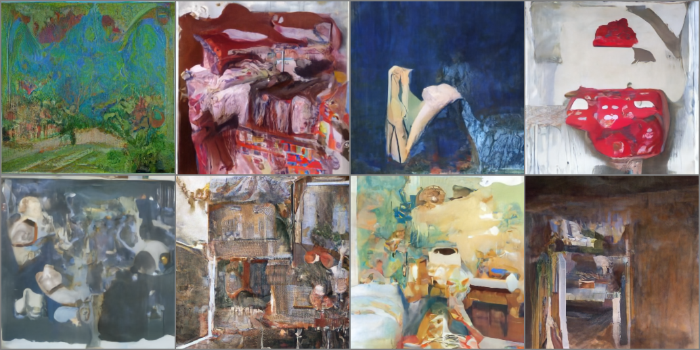
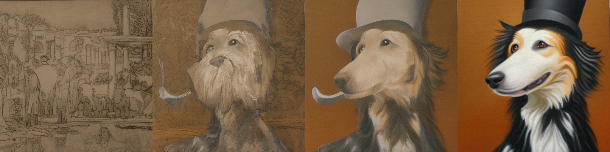

# 单元 2：微调、引导与条件生成

欢迎学习 Hugging Face 扩散模型课程第二单元！在本单元中，你将学习如何以新方式使用与改造预训练扩散模型，并了解如何通过额外输入作为**条件（conditioning）** 来控制生成过程。

## 开始本单元 🚀

建议步骤：

- 通过 [课程订阅表单](https://huggingface.us17.list-manage.com/subscribe?u=7f57e683fa28b51bfc493d048&id=ef963b4162) 订阅更新通知。
- 阅读下方本单元核心概念概览。
- 打开 **《微调与引导》** 笔记本，用 🤗 Diffusers 在新数据集上微调模型，并修改采样过程以使用引导。
- 按笔记本示例为自定义模型创建并分享 Gradio 演示。
- （可选）学习 **《类别条件扩散模型示例》** 笔记本，了解如何为生成过程增加控制。
- （可选）观看 [本单元概览视频](https://www.youtube.com/watch?v=mY20iKOQ2zw)。

📢 别忘了加入 [Discord](https://huggingface.co/join/discord)，在 `#diffusion-models-class` 频道交流。

## 微调（Fine-Tuning）

如单元 1 所见，从零训练扩散模型可能非常耗时；分辨率越高，成本越高。可行做法是：**从已训练模型出发**，利用其已学会的去噪能力，往往比随机初始化更好。

微调在新数据与预训练数据**有一定相似性**时效果最好（例如人脸预训练模型用于卡通人脸），但领域差异较大时仍常有效。上图来自在 [LSUN Bedrooms 模型](https://huggingface.co/google/ddpm-bedroom-256) 上微调 500 步 [WikiArt](https://huggingface.co/datasets/huggan/wikiart) 的示例。配套训练脚本见本目录的 [finetune_model.py](finetune_model.py)。

## 引导（Guidance）

无条件模型对生成内容控制有限。可训练**条件模型**（见下节）在生成时注入额外信息；若已有无条件模型，可使用**引导**：在每一步用某个引导函数评估并修正预测，使最终图像更符合目标。

引导函数几乎可任意设计，因而非常灵活。笔记本从简单示例（控制颜色，见上图）逐步过渡到使用 CLIP 等预训练模型，按文本描述引导生成。

## 条件生成（Conditioning）

引导能「榨取」无条件模型的潜力；若在训练时就有额外信息（类别标签、图像描述等），可直接喂给模型，得到**条件模型**，推理时通过改变条件控制输出。笔记本以 MNIST 上的类别条件模型为例演示。

常见条件注入方式包括：

- **作为 UNet 输入的额外通道**：适用于与图像同尺寸的条件（分割图、深度图、模糊图等）。笔记本将类别标签映射为嵌入并扩展到与输入同宽高，作为额外通道输入。
- **嵌入投影后加到 UNet 内部层**：类似时间步嵌入，加到各 ResNet 块输出；适用于 CLIP 图像嵌入等向量。例如 [Stable Diffusion 图像变体](https://huggingface.co/spaces/lambdalabs/stable-diffusion-image-variations)。
- **交叉注意力（cross-attention）**：让 UNet 各空间位置「关注」条件序列，尤其适合文本；单元 3 将详述 Stable Diffusion 的文本条件。

## 动手笔记本

| 章节 | 本地笔记本 |
|:-----|:-----------|
| 微调与引导 | [01_finetuning_and_guidance.ipynb](01_finetuning_and_guidance.ipynb) |
| 类别条件扩散模型示例 | [02_class_conditioned_diffusion_model_example.ipynb](02_class_conditioned_diffusion_model_example.ipynb) |

微调计算量较大；在 Colab / Kaggle 上请将运行时设为 **GPU**。

**《微调与引导》** 通过实例讲解微调与引导，并展示如何将结果发布为 Gradio Space。本仓库保留了 [finetune_model.py](finetune_model.py) 方便本地实验；也可参考官方 [示例 Space](https://huggingface.co/spaces/johnowhitaker/color-guided-wikiart-diffusion)。

**《类别条件扩散模型示例》** 在 MNIST 上用最简方式演示类别条件：向模型提供「正在去噪什么」的额外信息，即可在推理时控制生成类别。

## 项目时间

参照 **《微调与引导》**，微调自己的模型或对现有模型做引导，并制作 Gradio 演示。欢迎在 Discord、Twitter 等分享作品！

## 延伸阅读

- [Denoising Diffusion Implicit Models](https://arxiv.org/abs/2010.02502) — DDIM 采样（DDIMScheduler）  
- [GLIDE](https://arxiv.org/abs/2112.10741) — 文本条件扩散  
- [eDiffi](https://arxiv.org/abs/2211.01324) — 多种条件联合控制  

发现更多资源？欢迎反馈补充。

## 微调方法怎么选？

| 方法 | 训练内容 | 显存/存储成本 | 适合场景 |
|------|----------|---------------|----------|
| 全量微调 | 更新大部分或全部模型参数 | 高 | 数据量较大、目标域稳定、需要整体风格迁移 |
| DreamBooth | 让模型记住特定主体或风格 | 中到高 | 少样本个性化，如宠物、人物、产品 |
| Textual Inversion | 学习新的 token embedding | 低 | 概念较简单、希望模型主体不被过度改写 |
| LoRA | 训练低秩适配参数 | 低到中 | 现代个性化与风格迁移的常用选择 |

从工程角度看，DreamBooth 适合理解个性化微调的核心问题；但如果你要面向真实项目，通常应优先尝试 LoRA，因为它更便宜、更容易分享，也更适合与多个基础模型组合。

## Guidance 与 Conditioning 的判断

- 如果模型已经训练好，但你想在采样时临时施加偏好，优先考虑 **guidance**。
- 如果训练数据本身带有标签、文本、深度图或边缘图，并且你希望模型长期学会这些控制信号，应该使用 **conditioning**。
- 如果你想控制空间结构，后续可学习 ControlNet；如果你想引入参考图主体或风格，可学习 IP-Adapter。

本单元建立的是「控制生成」的基础语言：理解它之后，再看 ControlNet、IP-Adapter、LoRA、SDXL 都会更容易。
